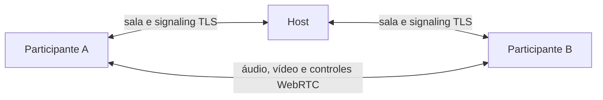

<p align="center">
  
</p>

<h1 align="center">Poglive</h1>

<p align="center">
  Compartilhamento privado de tela e áudio, direto entre amigos.
</p>

<p align="center">
  <a href="https://github.com/RenanHCosta/poglive/actions/workflows/ci.yml"></a>
  <a href="https://github.com/RenanHCosta/poglive/releases/latest"></a>
  <a href="LICENSE"></a>
  
</p>

Poglive é um aplicativo open source para criar salas privadas e compartilhar janelas,
monitores e áudio no Windows. Não exige conta: o host cria a sala, envia um convite e a
mídia trafega por conexões WebRTC entre os participantes.

> [!WARNING]
> As versões atuais ainda não possuem assinatura Authenticode e podem gerar um aviso do
> Windows SmartScreen. Baixe somente pelas
> [Releases oficiais](https://github.com/RenanHCosta/poglive/releases) e confira o hash
> SHA-256 publicado. [Entenda o status da assinatura](CODE_SIGNING_POLICY.md).

## Recursos

- Salas privadas para até oito participantes, sem cadastro ou servidor de mídia.
- Compartilhamento de monitor ou janela em 720p/1080p e 30/60 FPS.
- Várias transmissões abertas simultaneamente, com tela cheia e picture-in-picture.
- Áudio opcional: sem áudio, somente a janela, sistema exceto Discord ou sistema inteiro.
- Convites autenticados com segredo aleatório e pinning do certificado temporário da sala.
- Conexão em LAN e redes virtuais, incluindo descoberta pela interface do Radmin VPN.
- Atualizações automáticas na versão instalada; atualização manual na versão portátil.
- Sem anúncios, analytics ou coleta operada pelo desenvolvedor.

## Download

Acesse a [versão mais recente](https://github.com/RenanHCosta/poglive/releases/latest) e
escolha um dos pacotes:

| Pacote                   | Indicado para                                    | Atualização |
| ------------------------ | ------------------------------------------------ | ----------- |
| `Poglive-*-setup.exe`    | Uso normal, com atalhos e instalação por usuário | Automática  |
| `Poglive-*-portable.exe` | Executar sem instalar                            | Manual      |

O Poglive requer Windows x64. Os modos de áudio seletivo usam a API Application
Loopback, disponível a partir do Windows build 20348; em sistemas incompatíveis, use
vídeo sem áudio ou o loopback global oferecido pelo Windows.

## Como usar

1. Abra o Poglive e escolha seu nome local.
2. O host cria uma sala selecionando o IPv4 da LAN ou VPN que será usada.
3. Compartilhe o convite completo somente com pessoas de confiança.
4. Os convidados colam o convite e entram na sala.
5. Qualquer participante pode compartilhar uma janela ou monitor; os demais escolhem
   quais transmissões assistir.

O convite funciona como uma credencial enquanto a sala estiver aberta. Ele contém o
endereço necessário à conexão, um segredo e a impressão digital do certificado da sala.
Não o publique em issues, prints ou canais abertos.

Para instruções de rede, áudio, qualidade e solução de problemas, consulte o
[Guia do usuário](docs/user-guide.md).

## Como funciona



O host coordena entrada, presença e signaling. Depois da negociação, áudio, vídeo e
controles de transmissão seguem diretamente entre os participantes. Não há TURN ou
relay público; fora de uma rede roteável em comum, use uma VPN como o Radmin.

## Privacidade e segurança

- Tela e áudio só são capturados depois de uma escolha explícita.
- Microfone e câmera não são solicitados.
- Identidade e preferências ficam no perfil local do Windows.
- Convites, mídia e descrições WebRTC não são armazenados pelo Poglive após a sala.
- O diagnóstico de conexão mostra estados e contagens, sem copiar IPs ou SDP completo.

Leia a [Política de privacidade](PRIVACY.md) e a [Política de segurança](SECURITY.md).
Vulnerabilidades devem ser enviadas pelo
[canal privado do GitHub](https://github.com/RenanHCosta/poglive/security/advisories/new),
nunca por uma issue pública.

## Desenvolvimento

Requisitos: Windows x64, Node.js 22.12 ou superior, npm, CMake, Windows SDK e MSVC para
o helper nativo de áudio.

```powershell
npm ci
npm run dev
```

Verificação principal:

```powershell
npm run check
npm test
npm run build
```

Consulte [Desenvolvimento](docs/development.md) para ambiente e comandos,
[Testes](docs/testing.md) para os roteiros manuais e
[Releases](docs/releases.md) para empacotamento e publicação.

## Documentação

| Documento                                        | Conteúdo                                                    |
| ------------------------------------------------ | ----------------------------------------------------------- |
| [Guia do usuário](docs/user-guide.md)            | Salas, transmissões, áudio, rede e diagnóstico              |
| [Desenvolvimento](docs/development.md)           | Ambiente local, comandos e estrutura do projeto             |
| [Testes](docs/testing.md)                        | Verificações automatizadas e testes em uma ou duas máquinas |
| [Releases](docs/releases.md)                     | Instalador, portátil, atualizador e processo de publicação  |
| [Arquitetura](docs/architecture.md)              | Protocolos, limites, segurança e decisões técnicas          |
| [Política de assinatura](CODE_SIGNING_POLICY.md) | Integridade dos artefatos e status do Authenticode          |
| [Contribuindo](CONTRIBUTING.md)                  | Fluxo para issues e pull requests                           |

## Contribuindo

Issues e pull requests são bem-vindos. Para mudanças relevantes de comportamento,
protocolo, captura, rede ou atualização, abra primeiro uma issue descrevendo o problema
e a proposta. Veja [CONTRIBUTING.md](CONTRIBUTING.md).

## Licença

Poglive é distribuído sob a [licença MIT](LICENSE), copyright 2026 Renan Costa.
Dependências mantêm suas próprias licenças, listadas em
[THIRD_PARTY_NOTICES.md](THIRD_PARTY_NOTICES.md).
