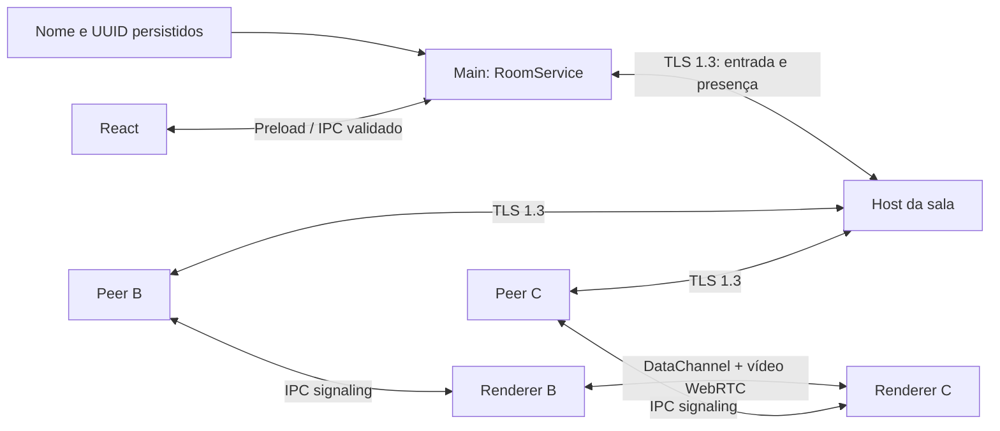

# Poglive — salas privadas

## Escopo atual

Aplicativo independente, sem conta, backend ou servidor de mídia. Salas, captura,
streaming WebRTC, múltiplos players e áudio opcional estão implementados. Desempenho,
60 FPS e áudio seletivo ainda exigem validação contínua entre computadores reais.
O host coordena admissão, presença e signaling WebRTC. Controle de transmissão e
vídeo passam diretamente entre os renderers dos participantes.



## Estrutura e responsabilidades

```text
src/
  main/
    index.ts                 janela, perfil e ciclo do aplicativo
    ipc.ts                   validação de origem/argumentos e comandos
    room/
      identity.ts            leitura e escrita atômica da identidade
      invite.ts              geração e parsing de convites compactos PL1
      service.ts             coordenação de ações e estado local
      host.ts                admissão, roster e saída
      client.ts              entrada, snapshots e desconexão
    transport/
      certificate.ts         certificado efêmero e pinning
      channel.ts             framing, validação, limites e heartbeat
  preload/index.ts            API restrita: informações, snapshot, comando
  renderer/
    components/              perfil, lobby, sessão, status
    pages/HomePage.tsx
    hooks/                   estado desktop e snapshots de sala
  shared/
    contracts.ts             ponte e estados compartilhados
    schemas/room.ts          identidade, convite, estado e comandos
    protocols/network.ts    união discriminada de mensagens
tests/room.test.ts
```

main/capture/service.ts cuida das fontes e autorizações de captura.
main/signaling/router.ts coordena o encaminhamento; renderer/services/PeerLink.ts
e PeerMesh.ts mantêm PeerConnections e presença. shared/protocols/signaling.ts
valida as mensagens e o lote IPC. discovery/networking, types/states separados só serão criados se
necessários. Evitamos diretórios vazios e camadas que apenas repassam chamadas.
Contratos não dependem de Electron. Rust/Tauri poderão substituir adaptadores;
captura/codecs/WebView precisarão de avaliação própria nessa migração.

## Identidade e estado

Sem perfil salvo, a UI pede nome. Salvar gera peerId com randomUUID e persiste
identity.json em userData. Mudanças de nome preservam o ID e são permitidas fora
da sala. Escrita temporária seguida de rename evita arquivo parcialmente escrito.
Arquivo inválido é preservado e causa erro explícito, em vez de identidade nova
silenciosa. Diretórios de perfis permitem duas instâncias independentes.
Uma instância por perfil impede gravações concorrentes no mesmo arquivo.

Estados da sala são uniões discriminadas: IDLE, CONNECTING, HOSTING, JOINED,
DISCONNECTED. HOSTING inclui convite e snapshot; JOINED inclui snapshot sem segredo.
Ações assíncronas são serializadas. O renderer consulta snapshots a cada 750 ms,
sem acesso direto aos sockets ou ao sistema de arquivos.

A identidade de rede é declarada pelo cliente; UUID não é autenticação. Quem tem
o segredo pode escolher outro nome/UUID. O host rejeita duplicação de ID ativa,
mas não faz verificação de pessoa, banimento persistente ou prevenção de Sybil.

## Convite e conexão

Formato textual: VS1. + base64url de JSON estrito:

```typescript
interface InviteV1 {
  version: 1;
  host: string; // IPv4 da interface selecionada
  port: number; // TCP, escolhido pelo SO
  roomId: string; // UUID aleatório da sala
  secret: string; // randomBytes(32), base64url
  fingerprint: string; // SHA-256 do certificado DER, 64 hex
}
```

O código contém os dados para conexão direta, não exige consulta externa.
IPv4 literal evita resolução DNS. O parser limita tamanho, versão e campos,
rejeita conteúdo adicional e verifica codificação canônica.
Base64url é transporte, não confidencialidade. Compartilhar o código inteiro
concede acesso à sala. Convites nunca são enviados em broadcast ou registrados.

O host escuta apenas no endereço escolhido, em porta dinâmica; não em todas as
interfaces. Loopback serve duas instâncias locais. IPv4 Wi-Fi/Ethernet serve a LAN.
UDP/mDNS não traz benefício necessário porque o convite já identifica o endpoint.

## Transporte seguro

TLS 1.3 nativo, certificado EC P-256/SHA-256 novo a cada sala. Certificado/chave
privada ficam em memória, sem gravação em disco. Validade: 7 dias.
A dependência [selfsigned](https://github.com/jfromaniello/selfsigned) gera X.509
usando crypto nativo; não implementamos certificados ou criptografia própria.

O cliente conclui TLS e compara SHA-256 do certificado apresentado com o pin do
convite, além do período de validade. Somente depois instala o canal de mensagens
e envia ROOM_JOIN com segredo. Não usa autoridades certificadoras públicas como
fonte de confiança: rejectUnauthorized=false está restrito a esse socket porque
o critério é o pin exato, verificado obrigatoriamente antes de dados da aplicação.
Não existe fallback que aceite pin incorreto. Há teste que comprova zero bytes
de aplicação enviados para host com certificado diferente.

O host compara o segredo com timingSafeEqual antes de aceitar o participante.
Segredo incorreto, ID duplicado e sala cheia geram recusa sem revelar o roster.
Certificado e segredo são separados: um membro com convite não possui a chave
privada do host original. Entretanto, quem conseguir substituir o convite por
outro completo controla o destino; compartilhe por canal confiável.

Base técnica: [Node TLS](https://nodejs.org/api/tls.html).
A cifra PSK inicialmente avaliada funcionou no Node de desenvolvimento mas não
no Electron; o transporte final acima foi validado em ambos os runtimes.
Não há mudança global em TLS, Chromium, CSP ou webSecurity.

## Protocolo e autoridade

Todas as mensagens têm version=1 e type discriminado; Zod infere NetworkMessage.
Framing: 4 bytes unsigned big-endian de tamanho + JSON UTF-8, no máximo 64 KiB.
Limites: 8 participantes, 16 conexões simultâneas, handshake/admissão de 5 s,
120 frames por segundo por conexão (incluindo rajadas ICE), fila de saída limitada.
Payloads malformados e mensagens fora do estado permitido encerram a conexão.
Estas defesas limitam recursos, mas não prometem resistir a DoS de rede dedicado.

| Mensagem                     | Uso                                                        |
| ---------------------------- | ---------------------------------------------------------- |
| ROOM_JOIN                    | roomId, segredo e identidade; primeira mensagem de domínio |
| ROOM_JOIN_ACCEPTED           | Snapshot completo após autenticação                        |
| ROOM_JOIN_REJECTED           | INVALID_SECRET, WRONG_ROOM, DUPLICATE_ID ou FULL           |
| PEER_JOINED / PEER_LEFT      | Notificações emitidas somente pelo host                    |
| ROOM_STATE                   | Snapshot autoritativo, IDs únicos e exatamente um host     |
| PING / PONG                  | Nonce novo e resposta correspondente para liveness         |
| WEBRTC_OFFER / WEBRTC_ANSWER | Sala, remetente, destino e negotiationId validados no M4   |
| ICE_CANDIDATE                | Candidato limitado, inclusive null; negociação validada    |

O host não aceita roster, identidade alheia ou eventos de mídia enviados por
participantes neste marco. Um cliente aceita estados somente da conexão ao host
fixado no convite, para a sala correta, contendo seu ID e o mesmo host da admissão.
O host transmite snapshots somente aos canais admitidos.
PEER_JOINED/LEFT são notificações; ROOM_STATE é a fonte de verdade para a UI.

No M4 o host autentica remetente pela conexão, valida fromPeerId e preenche esse
campo no encaminhamento. Valida sala, destino e negociação ativa por par.
Não confiar em um fromPeerId declarado na rede. Controle de mídia no M5 tem schema
separado e não é aceito no transporte TLS da sala (detalhes abaixo).

## Saída e falhas

Saída voluntária fecha o socket; host remove o peer e publica estado.
Fechamento abrupto é detectado por TCP ou heartbeat. PING a cada 4 s quando não
há desafio pendente; deadline de resposta 12 s, detecção em aproximadamente 16–20 s
para perda silenciosa, mais atraso de UI/event loop.
PONG só conta se corresponder ao nonce pendente. Frames quaisquer não mantêm vivo
um participante que não responde ao desafio.

Fechar o host encerra a sala. Os clientes mostram DISCONNECTED e podem entrar de
novo ou criar sala. Sem migração de host, restauração ou reconexão automática.
Erro de criação/entrada devolve mensagem recuperável. Sockets, timers e listas são
limpos ao sair. Uma sala nova gera novas credenciais e invalida o convite anterior.

Logs mostram apenas categoria e evento: Hosting, Joined, Peer joined/left,
Disconnected. Não registrar nomes, IPs, convites, segredos, certificados privados,
SDP ou payloads. Snapshot da UI inclui o convite apenas para quem hospeda.
A cópia para clipboard é explícita; o app não promete limpar histórico/sincronização
do clipboard do sistema. O teste visual usa sala efêmera já encerrada.

## Electron e UI

Preservados contextIsolation=true, sandbox=true, nodeIntegration=false,
webSecurity=true, protocolo local com restrição de caminhos, CSP, nonce do
desenvolvimento e bloqueio de navegação/janelas/webview. Permissões permanecem
negadas, exceto tela cheia e display-capture para o mainFrame do renderer local;
captura exige seleção pendente válida. Tela cheia usa gesto no botão do player.
O handler de captura mantém
compatibilidade com Electron 44: a permissão antiga media com mediaTypes vazio
também é aceita somente no mainFrame confiável e com seleção ainda válida. Pedidos
de câmera/microfone (mediaTypes preenchido) continuam negados. Essa diferença foi
corrigida no Electron 45 ([PR oficial](https://github.com/electron/electron/pull/52824)).
O handler específico de captura exige
mainFrame, gesto do usuário, fonte previamente selecionada e autorização de uso
único válida por 10 segundos. Áudio só é liberado se a seleção IPC o autorizou
explicitamente no Windows, com audioRequested correspondente. A fonte é reconsultada antes de liberar.
Novos comandos IPC validam origem, mainFrame, quantidade de argumentos e payload.
Preload valida respostas e só expõe métodos fixos; não expõe ipcRenderer nem
clipboard genérico. Clipboard só recebe o convite atual gerado pelo main.

Componentes reutilizáveis: IdentityForm, RoomLobby, SessionCard, StatusBadge.
CapturePanel e useCapture adicionam seleção de monitor/janela, miniaturas e preview
local com getDisplayMedia. RoomMedia disponibiliza a captura ao PeerMesh para o M5.
Estados explícitos da captura: IDLE, LOADING,
SELECTING_SOURCE, STARTING, PREVIEW e ERROR. Stream só vive no renderer.
Cancelar, encerrar ou desmontar o componente ao sair da sala libera todas as tracks;
respostas assíncronas antigas são descartadas e streams tardios são encerrados.
Track ended gera aviso recuperável. Fontes minimizadas/protegidas podem congelar
sem emitir ended; ainda exigem encerramento manual nesses casos.
Schema de captura valida fonte/miniatura e IPC; nenhuma API Node nova é exposta.

## Conexão direta WebRTC

Cada par cria uma PeerConnection com o endpoint STUN local do host. Ele usa o mesmo
IP/porta do convite, em UDP, para produzir um candidato pela rota explícita da sala;
não existe STUN público nem TURN. O UUID lexicograficamente menor oferece; o outro responde.
Signaling segue por IPC e TLS pelo host, inclusive entre dois convidados.
O host mantém uma negociação ativa por par e descarta ICE/respostas obsoletos.
Filas de entrada têm limite de 128 sinais/512 KB; polling IPC a cada 250 ms.
SDP local precede o envio de ICE; ICE remoto aguarda remoteDescription em fila
limitada. Saída encerra os recursos e remove negociações do peer.

DataChannel poglive-control troca HELLO/ACK e controle de mídia validado, com
limite de tamanho e quantidade. A UI só indica WebRTC conectado após confirmação por esse
canal direto. Não comprova desempenho de vídeo; apenas estabelecimento do caminho.
Timeout inicial de 25 segundos gera erro. Sem ICE restart/reconexão automática
neste marco: sair/entrar reinicia o fluxo. Use a mesma versão do app em todos os PCs.
O host é a autoridade de signaling e precisa ser confiável.
Logs registram transições, nunca SDP ou endereços ICE. Uma sala TCP funcionando
não garante que o firewall permita o caminho WebRTC.

No Windows, o main process define a política WebRTC `default`, que permite enumerar
todas as interfaces, inclusive adaptadores de LAN virtual. Antes de o Chromium iniciar,
o app também desativa `WebRtcHideLocalIpsWithMdns`: peers em Radmin e redes equivalentes
recebem candidatos host com IP literal em vez de aliases `.local` que podem não ser
resolvidos pelo outro PC. Esta última integração é uma feature flag do Chromium e deve
ser revalidada a cada atualização do Electron.

O trade-off é explícito: endereços das interfaces locais/VPN fazem parte do signaling
e são visíveis aos participantes que possuem o convite. Eles não são mostrados na UI
nem registrados; o diagnóstico expõe somente contagens de candidatos mDNS/IP. O segredo
da sala, TLS com pin e validação do protocolo continuam inalterados.

O `WebContents` limita candidatos WebRTC à faixa UDP `52000-52100` usando a API oficial
`setWebRTCUDPPortRange`. Separadamente, `LanStunServer` implementa apenas Binding Request
IPv4 e XOR-MAPPED-ADDRESS no host, com limite global e por origem. Ele escuta no endereço
selecionado para a sala e na mesma porta numérica do listener TLS, possível porque um usa
UDP e o outro TCP. Mensagens inválidas são ignoradas e nenhum endereço é registrado.
O diagnóstico conta candidatos UDP, Radmin e STUN sem revelar portas/IPs individuais.

## Qualidade e conectividade externa

O host coordena signaling, não atua como relay de vídeo por ser host.
O streamer usa a PeerConnection de cada espectador; upload cresce por espectador.
Captura usa desktopCapturer/main e getDisplayMedia/renderer com autorização de
fonte. Chromium/WebRTC negocia codecs disponíveis; sem encoder próprio.
720p/1080p, 30/60 FPS e áudio opcional estão disponíveis, sem garantia de taxa efetiva.
Loopback global pode incluir qualquer áudio do sistema; os modos seletivos e o
desempenho continuam sujeitos ao hardware e à versão do Windows.

Internet exige distinguir alcance do host TCP de ICE para mídia. STUN não abre
o listener TCP do host atrás de NAT/CGNAT. Pode ser necessário signaling externo
mínimo ou rota explicitamente configurada; não usaremos UPnP automático no MVP.
STUN auxilia descoberta de candidatos WebRTC. TURN autenticado retransmite mídia
quando ICE não encontra rota direta. Vídeo direto não passa pelo signaling.
O tipo de rota selecionada será medido e mostrado; não prometer P2P universal.
Referências: [WebRTC connections](https://webrtc.org/getting-started/peer-connections),
[TURN](https://webrtc.org/getting-started/turn-server).

## Streaming

Arquivos: shared/protocols/media.ts (Zod/união discriminada), PeerMedia.ts
(controle e sender), PeerLink.ts (transceiver/DataChannel), PeerMesh.ts
(captura e seleção do espectador), RoomMedia.tsx, CapturePanel.tsx,
PeerConnections.tsx e RemoteVideo.tsx. O controle de mídia preserva as fronteiras de
IPC/preload e TLS; as opções de captura são validadas ponta a ponta.
network.ts remove os schemas reservados de stream: não são mensagens de sala TLS.

Cada par negocia transceivers video e audio sendrecv vazios junto ao DataChannel.
O respondente também declara sendrecv antes da resposta. PeerMedia usa
replaceTrack somente após WATCH_REQUEST válido para o streamId atual e com
captura local viva; null desliga o envio sem parar a captura compartilhada.
Isso segue a [API WebRTC do W3C](https://www.w3.org/TR/webrtc/#dom-rtcrtpsender-replacetrack).
A API pode recusar troca que exija renegociação: neste MVP isso gera erro de
conexão, não fallback silencioso ou upload por servidor.

Controle direto, ordenado e confiável: STREAM_STARTED, STREAM_STOPPED,
WATCH_REQUEST, WATCH_STOP e WATCH_ACCEPTED; version=1 e streamId UUID.
Schema estrito, máximo 1024 caracteres por mensagem, 20 mensagens/s por peer e
buffer de saída limitado a 64 KiB. Payload inválido fecha apenas aquele PeerLink.
Operações replaceTrack pendentes também são limitadas a 8 por PeerLink.
Identidade vem da conexão negociada através do host confiável, nunca do payload.
O host é autoridade de admissão/signaling, não há proteção contra um host malicioso.
Todos os membros admitidos podem assistir/compartilhar; não há ACL individual.

Selecionar uma fonte anuncia sua disponibilidade. Sem solicitação de espectador,
nenhuma track local é ligada ao sender. Novos links confirmados recebem o anúncio
atual. Encerrar captura limpa subscriptions, desliga senders e envia STOPPED.
Fim da fonte também encerra as tracks pelo useCapture; fechar a sala desmonta
captura, players, DataChannels, PeerConnections e timers. Fonte que congela sem
evento ended continua exigindo encerramento manual.

Assistir envia solicitação explícita. Estado remoto: IDLE, CONNECTING, WATCHING,
ERROR; timeout de início de 15 s. O player também aguarda reprodução e oferece
erro se vídeo não iniciar. Cada peer mantém uma assinatura independente, permitindo
assistir a várias transmissões ao mesmo tempo e encerrar somente o player escolhido.
No transmissor, cada peer aparece em “Assistindo sua Live” somente após as tracks
serem ligadas ao sender com sucesso; WATCH_STOP, troca de captura, falha ou saída
do peer removem o espectador da lista.
Sair do player não sai da sala nem encerra o stream para outros espectadores.
Uma captura por participante, um player remoto por peer; até 7 cópias de vídeo
por transmissor. Não há garantia de capacidade/latência nessa cardinalidade.
Vídeo/áudio usam Chromium/WebRTC; codecs automáticos, sem encoder próprio.
STUN público e TURN continuam ausentes. Presets e áudio opcional são descritos abaixo.

## Áudio e qualidade

CAPTURE_PROFILES centraliza 720p (1280×720) e 1080p (1920×1080).
captureOptionsSchema valida frameRate como 30 ou 60 e audioMode como
NONE/SYSTEM/WINDOW/SYSTEM_EXCEPT_DISCORD, ponta a ponta no IPC.
CapturePanel seleciona opções antes da fonte; useCapture aplica constraints máximas
e mostra getSettings (configuração da captura, não estatística do RTP remoto).
Sem upscale garantido e sem troca dinâmica; uma captura nova mantém o fluxo de
anúncio/subscription existente. 60 FPS foi adicionado e exige validação manual de desempenho.

captureSelectionSchema valida id + opções no preload e main. A autorização de
uso único inclui o pedido de áudio global; pedido divergente é recusado. Permissões de câmera
e microfone continuam negadas: a compatibilidade media/empty mediaTypes do Electron
44 foi mantida, sem liberar pedidos de dispositivos de áudio.
No Windows, o handler usa audio: loopback apenas com consentimento explícito.
Referência: [Electron setDisplayMediaRequestHandler](https://www.electronjs.org/docs/latest/api/session#sessetdisplaymediarequesthandlerhandler-opts).
SYSTEM captura todo o som, inclusive fora da janela selecionada. Não usa
loopbackWithMute.

WINDOW não solicita áudio ao Chromium. O ID `window:HWND:...` documentado pelo Electron
é validado contra a lista recém-autorizada e encaminhado como argumento numérico fixo
ao helper C++ `poglive-process-audio`, iniciado sem shell/janela. Ele resolve HWND
para PID e usa `AUDIOCLIENT_ACTIVATION_TYPE_PROCESS_LOOPBACK` com
`INCLUDE_TARGET_PROCESS_TREE`. PCM estéreo 48 kHz/16-bit segue por stdout para IPC
unidirecional limitado; AudioWorklet mantém jitter buffer adaptativo de 40–160 ms,
inicia em 80 ms, aumenta após underrun e reduz lentamente após reprodução estável.
Correção de taxa de ±0,5% com interpolação aproxima a fila do alvo sem saltos abruptos.
O worklet cria a MediaStreamTrack com fila máxima limitada a um segundo.
Encerrar captura mata o helper, remove listeners e fecha AudioContext/tracks.

SYSTEM_EXCEPT_DISCORD também não solicita áudio ao Chromium. O helper enumera processos,
reconhece Discord Stable/Canary/PTB/Development, encontra a raiz da árvore e usa
`EXCLUDE_TARGET_PROCESS_TREE`. Sem Discord aberto, exclui a própria árvore silenciosa do
helper, equivalendo ao loopback global. O filtro atua sobre processos, não títulos de janela.

O helper é um sidecar separado para preservar isolamento e facilitar futura migração
para Rust/Tauri. É compilado via CMake/MSVC antes do empacotamento e incluído em
extraResources. A API requer Windows build 20348+; falhas encerram apenas o áudio
isolado, sem fallback para SYSTEM. Validação em hardware real continua pendente.

PeerLink pré-negocia uma track de cada tipo, mesmo em sessões sem áudio. PeerMedia
mantém um MediaStream remoto com os dois receivers; só liga tracks locais após
WATCH_REQUEST válido. WATCH_STOP/encerramento desliga ambos os senders com null.
mediaSender.ts configura setParameters: maxFramerate 30/60 conforme constraints da captura, maxBitrate de vídeo
2,5 Mbps até 720 linhas ou 5 Mbps acima em 30 FPS; em 60 FPS, 5/10 Mbps.
Áudio 128 kbps por espectador em ambos os modos.
Esses valores não incluem todo overhead nem garantem throughput/resolução.
Referência: [WebRTC RTCRtpSender](https://www.w3.org/TR/webrtc/#dom-rtcrtpsender-setparameters).
Chromium escolhe os codecs/encoder disponíveis; NVENC/AMF/Quick Sync, AV1 e outros
controles explícitos permanecem futuros, sem prometer aceleração ativa.

Sem track de áudio: aviso e vídeo continua. Pedido de captura ou constraints que
falha: erro recuperável, usuário pode tentar sem som ou em outra qualidade. Track
de áudio encerrada: aviso; vídeo segue. Erro ao configurar sender fecha o PeerLink.
Preview local é sempre mudo; player remoto começa mudo e exige botão Ativar áudio.
Silenciar não cancela a assinatura, apenas a reprodução. Sair cancela ambos os envios.
Loopback pode recapturar o player: fones não evitam esse ciclo de software; silenciar
o player é necessário para evitá-lo ao compartilhar e assistir simultaneamente.

## Roadmap e verificação

### Distribuição e atualizações

electron-builder.json gera NSIS e portable Windows x64 como usuário comum, com saída
em release/. `npm run dist:win` compila antes e usa `--publish never`. O NSIS é a
distribuição principal e recebe atualizações por `electron-updater` a partir das Releases
públicas de `RenanHCosta/poglive`; o portátil é secundário e permanece manual.

O build gera `latest.yml` e o `.blockmap` do instalador. O processo principal consulta
ao abrir e a cada seis horas, baixa automaticamente e publica apenas estado validado
pelo preload. Reinício manual é recusado enquanto houver sala ativa; uma atualização
baixada também pode ser aplicada no encerramento normal. Desenvolvimento, outras
plataformas e execução portátil desativam o updater. CSP, sandbox e preload permanecem.

Os executáveis ainda não possuem Authenticode. O manifesto contém SHA-512 e o GitHub
fornece HTTPS, mas assinatura de código continua recomendada antes de tratar o canal
como distribuição de produção plenamente endurecida.

Após a candidatura gratuita à SignPath Foundation não ser aceita por visibilidade
pública ainda insuficiente, tags estáveis continuam usando o job de release não
assinada. Esse job confirma que os artefatos estão sem Authenticode, publica um aviso
explícito e não inclui `publisherName` no canal de atualização. Uma futura aprovação e
a variável de repositório `SIGNPATH_ENABLED=true` trocarão o mesmo gatilho de tags para
o job assinado e passarão a exigir `SignPath Foundation` nas atualizações.

ASAR inclui somente bundles main/preload/renderer e metadados do pacote; fontes,
source maps, testes, perfis e segredos ficam de fora. node_modules não é incluído:
esbuild empacota as dependências de runtime, exceto Electron/APIs nativas do Node.
npmRebuild está desligado porque não há addon Node nativo; o helper WASAPI é um sidecar
compilado separadamente. Revisar essa decisão se um addon for introduzido. ASAR não é
criptografia nem proteção de código.

Portátil é sem instalação, não perfil transportável: userData continua em AppData
por usuário, com --profile para instâncias independentes. Distribui-se somente o
.exe portátil, nunca perfis nem o .exe avulso de win-unpacked. O pacote não publica
dados e não altera as limitações LAN/áudio. Validação de funcionamento empacotado
é manual; geração e inspeção do arquivo não comprovam funcionamento em outro PC.

1. Concluído: Electron, React, IPC e CSP.
2. Concluído: identidade local, sala privada, convite, admissão, roster e saída;
   usuário confirmou funcionamento.
3. Concluído: captura de monitor/janela e preview local, confirmado pelo usuário.
4. Concluído: signaling WebRTC coordenado pelo host e conexão peer-to-peer;
   usuário confirmou funcionamento.
5. Concluído: streaming entre participantes autorizados, confirmado pelo usuário.
6. Áudio opcional, 720p/1080p e 30 FPS validados inicialmente pelo usuário.
   60 FPS e exclusão da árvore do Discord implementados, aguardando teste manual
   em dois PCs.
7. Internet: STUN, NAT traversal, TURN e signaling mínimo conforme necessidade.

Testes automatizados exercitam TLS real em loopback e runtime Electron, segurança
da ponte e CSP. Não substituem validação visual nem conectividade entre dois PCs.
Por solicitação do usuário, os M3–M6 não adicionam nem executam testes automatizados.
Compilação/lint e instruções de teste manual acompanham a entrega.
Funcionalidades de mídia permanecem sujeitas a teste manual entre duas máquinas; build,
lint e smoke não comprovam continuidade, isolamento, latência ou desempenho reais.
